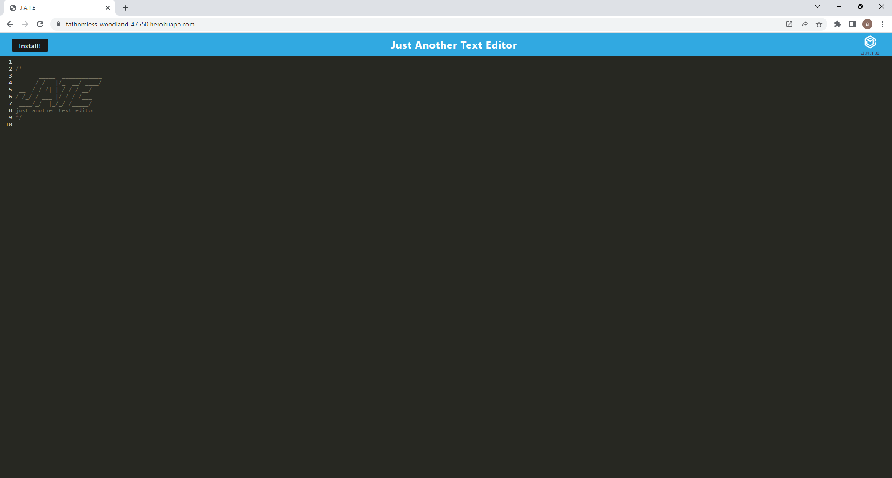

# PWA-Text-Editor

Hello and welcome to Just Another Text Editor!

This text editor, or JATE, allows you to to write any text or code on your browser and saves the text through your browser storage!

It also allows you to install the application to your computer so you can work off-line with it if needed!

If you have the code, it can be run by using the 'npm run start' command on your CLI, or you can visit [this page](https://fathomless-woodland-47550.herokuapp.com/).

